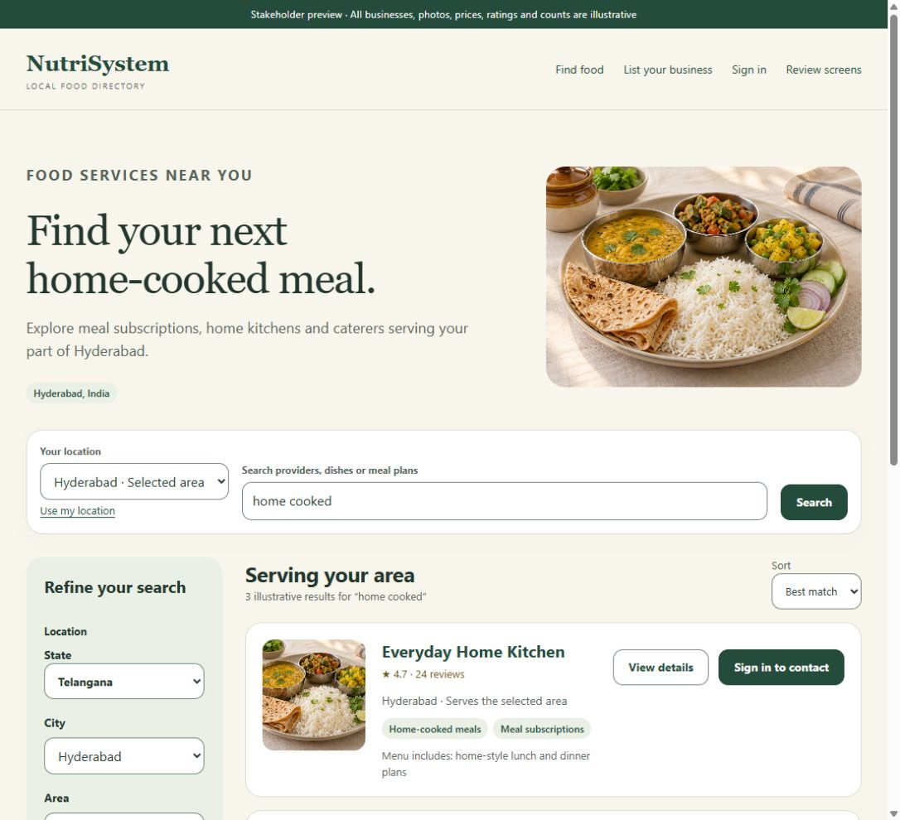

# NutriSystem

A mobile-friendly directory for meal subscriptions, home kitchens and event caterers in Hyderabad, India, developed using BMAD.

The PRD and UX mockups are ready for stakeholder review. Stakeholder approval and implementation readiness remain pending. This repository contains specifications and static review screens; application services have not been implemented.

## Start the review

Use the stakeholder review PR in [Pull requests](https://github.com/manojirukulla/nutrisystem/pulls) for feedback. Open **Files changed** to comment on specific files and lines. Keep one question or requested change per thread; discussion, decisions and fixes remain attached to that thread. Follow the [review guide](_bmad-output/planning-artifacts/ux-designs/ux-nutrisystem-2026-10-07/REVIEW.md) for submission and resolution steps. This repository is private, so reviewers need a GitHub account with repository access.

- [Product brief](_bmad-output/planning-artifacts/briefs/brief-nutrisystem-2026-10-07/brief.md): purpose and pilot scope.
- [PRD](_bmad-output/planning-artifacts/prds/prd-nutrisystem-2026-10-07/prd.md): requirements, user journeys and decisions.
- [Review guide](_bmad-output/planning-artifacts/ux-designs/ux-nutrisystem-2026-10-07/REVIEW.md): Customer, Provider and SuperAdmin walkthrough.
- [Visual design](_bmad-output/planning-artifacts/ux-designs/ux-nutrisystem-2026-10-07/DESIGN.md) and [experience specification](_bmad-output/planning-artifacts/ux-designs/ux-nutrisystem-2026-10-07/EXPERIENCE.md).
- [Optional offline preview ZIP](_bmad-output/stakeholder-review/nutrisystem-review-2026-10-07.zip): documents, 13 HTML pages and image assets. Submit feedback in the PR.

For a visual walkthrough, download and extract the ZIP (or clone this branch) and open `_bmad-output/planning-artifacts/ux-designs/ux-nutrisystem-2026-10-07/mockups/index.html` in your browser. Keep the folders together. GitHub's HTML file view displays source. For visual feedback, comment on the corresponding HTML file or UX specification line, identify the screen and element, and attach a screenshot when helpful.

All businesses, ratings, prices, reviews and food imagery in the mockups are illustrative. Preview links navigate between examples; they do not authenticate, save data, upload media, publish listings or send messages.

## Current decisions

Public discovery uses basic text search and filters, with menu details and pictures/videos supporting provider selection. Sign-in is required for contact access and reviews. SuperAdmin handles initial publishing, listing-edit approval, ownership and moderation; menu edits after publication need no approval. Self-review is prohibited. Removal or appeal requests go to SuperAdmin through the app or email with the review ID. Browser/platform translation is the pilot approach. Budget follows architecture's stack/cloud decisions. GTM remains deferred.

Use the PRD for the complete decision register. Review feedback should identify the requirement or screen, the observed issue and the requested change.

## Project handoff and tooling

- [Current status and discussion handoff](docs/HANDOFF.md)
- [BMAD installation and runtime](docs/BMAD-SETUP.md)
- [Agent working agreement](AGENTS.md)

BMAD Core and BMM 6.12.1 are installed under `_bmad/`, with 29 Codex skills under `.agents/skills/`. Canonical specifications live under `_bmad-output/`. Local tooling, caches, secrets and personal configuration are ignored by Git.

Next: stakeholder review and feedback reconciliation, then architecture, epics/stories and implementation-readiness planning.
